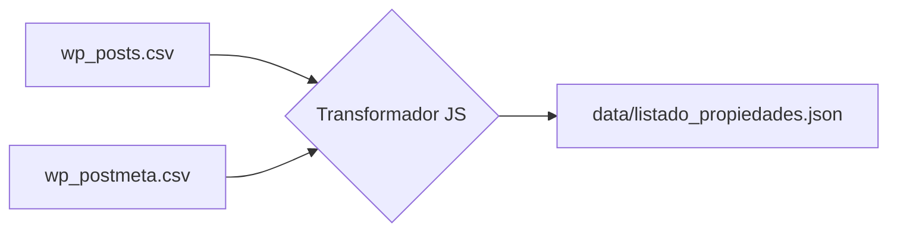

# Estrategia y Estructura de Datos

Este documento detalla cómo se gestionan los datos en el proyecto Daniel Brarda y la relación entre la base de datos original (WordPress) y el sistema actual.

## 1. Fuentes de Datos Origianles (CSV)

Los archivos CSV provienen de una exportación de tablas de WordPress utilizando el plugin "Real Homes" o similar.

### `wp_posts.csv`
- **ID:** Identificador único de la propiedad.
- **post_title:** Nombre comercial de la propiedad.
- **post_type:** Filtrado por valor `"property"`.
- **post_status:** Normalmente `"publish"`.

### `wp_postmeta.csv`
Contiene la "carne" de la información mediante un sistema de Clave-Valor orientado al ID del post.
- **`REAL_HOMES_property_price`**: Precio de venta o alquiler.
- **`REAL_HOMES_property_address`**: Dirección física.
- **`REAL_HOMES_property_location`**: Coordenadas lat/lng (ej: `-30.7, -57.9, 15`).
- **`REAL_HOMES_property_id`**: Código interno (ej: `ES-5176-Propiedad`).

## 2. Proceso de Transformación (Pipeline)

El sistema utiliza scripts de Node.js para convertir estos CSVs planos en un JSON estructurado consumible por el Frontend.



### Script de Recuperación (`recover_missing.js`)
Detecta discrepancias entre la cantidad de propiedades en `wp_posts` y el JSON final. 
- **Lógica de detección:** Compara los IDs de tipo `"property"` en el CSV contra los IDs presentes en el JSON.
- **Casos especiales:** Limpieza automática de caracteres basura de WordPress (tags HTML y metadatos serializados defectuosos).

## 3. Estructura del JSON Final
Cada objeto en el array principal sigue este esquema:
```json
{
  "id": "5176",
  "titulo": "Casa en Bº Naranjal",
  "precio": "150000",
  "direccion": "Ermácora 3410, Chajarí",
  "coordenadas": "-30.76...,-57.98...",
  "caracteristicas": ["Agua corriente", "Gas Natural"],
  "tipos": ["Casas"],
  "estados": ["Venta"]
}
```

## 4. Recomendaciones de Escala
Si el volumen de propiedades supera las 5,000 unidades, se recomienda:
1. Migrar el almacenamiento de JSON a una base de datos documental (MongoDB o Firebase).
2. Implementar un Backend con filtrado en servidor en lugar de filtrado en cliente (JS en el navegador).
